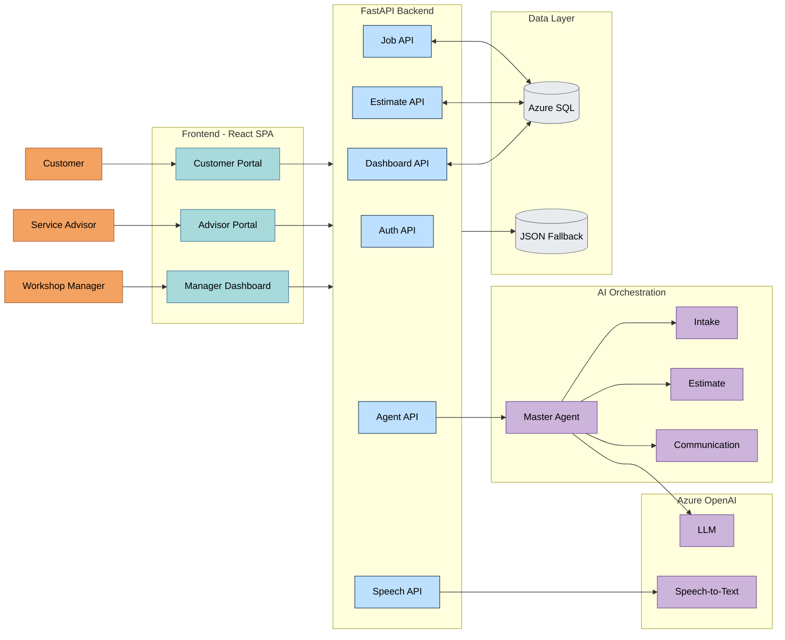
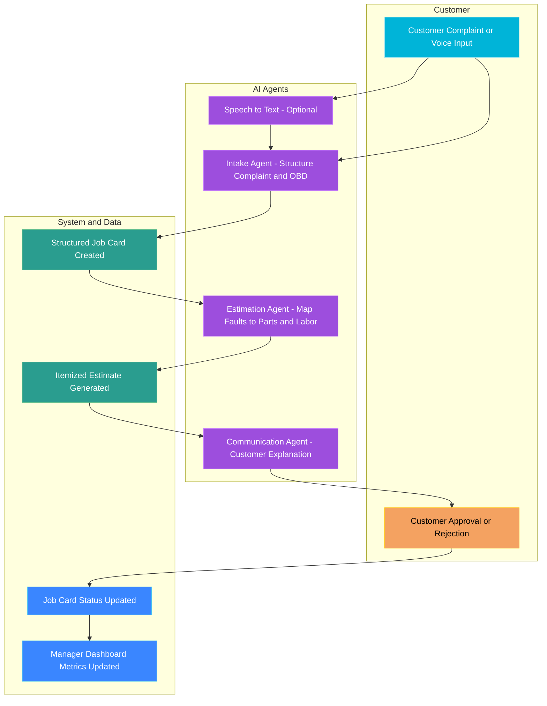
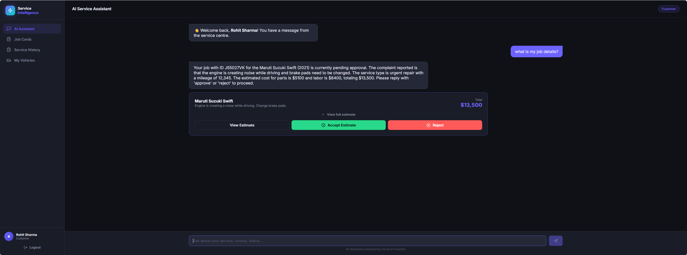
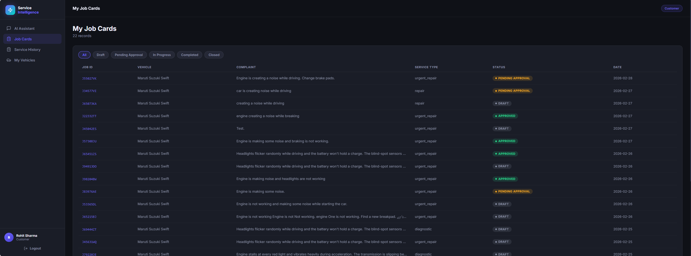
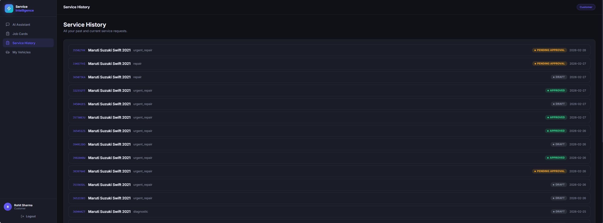
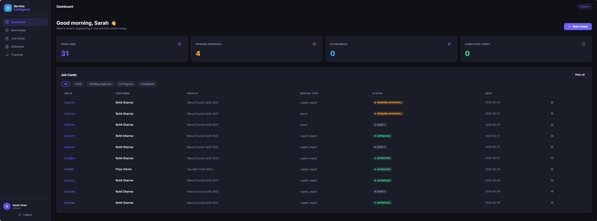
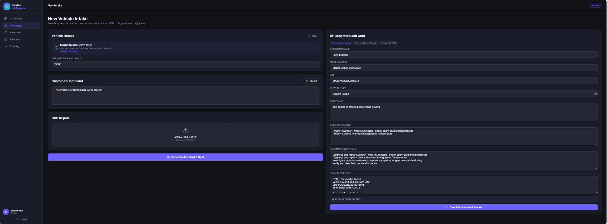
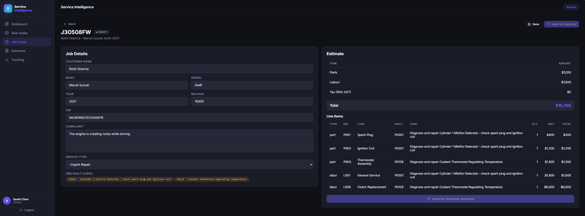
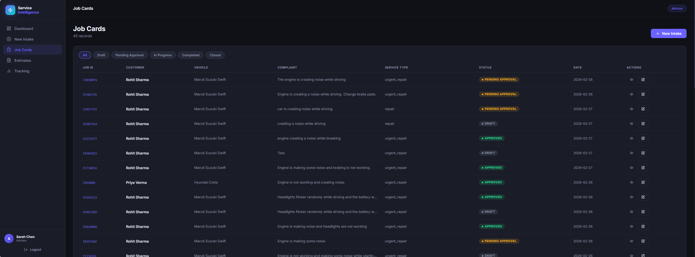
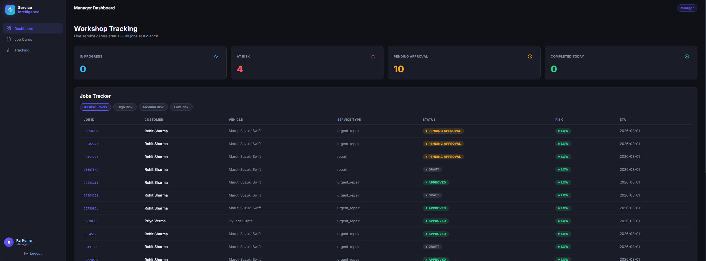

# AI-Powered Service Intelligence

## Service Advisor AI Intelligence for Modern Workshops

> *“Your car will be ready by evening.”*
>
> That sentence is said thousands of times a day across service centers often without real data behind it.

In busy automobile workshops, advisors juggle customers, OBD diagnostics, parts availability, insurance checks, and technician workloads all while trying to provide fast, transparent service. The result?

* Delays.
* Inconsistent estimates.
* Frustrated customers.
* Revenue leakage.
* Managers flying blind.

**Service Advisor AI Intelligence** is an AI-powered multi-agent system that augments existing workshop systems (not replaces them), transforming raw complaints and OBD codes into structured job cards, intelligent estimates, proactive communication, and live operational visibility.

Built on **Azure OpenAI + FastAPI + React + Azure SQL**, it is designed to be enterprise-ready, hackathon-safe (synthetic data), and demo-friendly.

---

# The Story: From Chaos to Intelligence

### Meet Sarah, a Service Advisor

It’s 9:15 AM. Five customers are already waiting.

A customer says:

> “The car shakes at high speed and there’s a weird noise when braking.”

Sarah:

* Types a long narrative.
* Uploads an OBD report.
* Tries to remember common failure mappings.
* Manually checks parts and labor.
* Calls the customer later to explain charges.

Now multiply this by 20 cars per day.

The system today:

* Treats OBD files as text type file.
* Stores complaints as unstructured text.
* Requires manual estimate mapping.
* Communicates reactively.
* Offers managers only static reports.

---

### With Service Advisor AI Intelligence

Sarah clicks **“New Intake”**.

* Speaks the complaint.
* Uploads the OBD file.
* AI instantly:

  * Extracts fault codes.
  * Maps likely systems.
  * Creates a structured job card.
  * Flags risk level.
  * Suggests tasks.

She clicks **Generate Estimate**.

* Parts + labor are auto-resolved.
* Tax + totals computed.
* A customer-friendly explanation is generated.

Customer receives:

> “We recommend replacing brake pads due to DTC C1234 indicating excessive wear. Estimated completion: 6–8 hours.”

Manager dashboard updates in real time:

* Revenue at risk
* Delayed jobs
* High-complexity repairs

The workshop becomes:

* Faster
* More transparent
* Data-driven
* Predictive instead of reactive

---

# Problem Statement

Modern automobile workshops face systemic inefficiencies:

## 1. Manual, Slow Intake

* Unstructured complaints.
* OBD logs treated as attachments.
* High variability between advisors.

## 2. Inconsistent Estimates

* Fault-to-part mapping is experience-based.
* Revenue leakage from missed operations.
* Misapplied warranty or insurance logic.

## 3. Reactive Customer Communication

* Calls and WhatsApp messages.
* No explainability.
* Low estimate approval rates.

## 4. Poor Use of Historical Data

* No learning loop from past jobs.
* No structured fault trend analysis.

## 5. No Predictive Visibility

* Managers rely on static reports.
* No ETA intelligence.
* No risk classification.

---

# Solution Overview

## Multi-Agent Service Intelligence System

The system uses a **Master Orchestrator Agent** that coordinates specialist agents.

### Core Agents (Implemented)

| Agent                   | Responsibility                                 |
| ----------------------- | ---------------------------------------------- |
| **Intake Agent**        | Converts complaint + OBD → structured job card |
| **Estimation Agent**    | Fault codes → parts + labor + pricing          |
| **Communication Agent** | Customer-friendly explanations & negotiation   |
| **Master Agent**        | Intent routing & multi-step orchestration      |

### Solution Architecture Diagram



 


### Functional Flow Diagram



### Future Scope (Planned Agent)

| Agent                | Responsibility                                      |
| -------------------- | --------------------------------------------------- |
| **ETA & Risk Agent** | Predicts completion time and flags operational risk |

---

# ETA & Risk Agent (Future Scope – Strategic Differentiator)

The current MVP uses heuristic ETA calculations.

The **ETA & Risk Agent (Planned)** will:

### Multi-Factor ETA Prediction

* Historical job durations
* Technician skill mapping
* Bay occupancy
* Parts availability
* Fault complexity score

### Risk Classification

* Safety-critical faults
* Regulatory impact
* Repeat failures
* High-value revenue jobs
* Insurance dependency

### Manager Benefits

* Early delay detection
* Smart workload balancing
* Predictive SLA adherence
* Revenue forecasting

### Business Value Impact

| Metric                 | Expected Improvement |
| ---------------------- | -------------------- |
| Estimate Approval Rate | +15–25%              |
| Intake Time            | -40%                 |
| Revenue Leakage        | -10–18%              |
| Customer Satisfaction  | +20%                 |
| On-time Delivery       | +30%                 |

This transforms the workshop from operational to predictive intelligence.

---

# Architecture Overview

## Layered Solution Architecture

Users → React SPA → FastAPI → Agent Orchestration → Azure OpenAI → Azure SQL

### Key Principles

* Clear separation of concerns
* Role-based access
* Structured LLM outputs
* Synthetic data only
* Graceful fallback

---

# Reasoning & Multi-Step Thinking

This is NOT a single prompt chatbot.

Each flow involves:

1. Intent detection (Master Agent)
2. Context assembly (job card + DB data)
3. Tool selection (specialist agent)
4. Structured response validation
5. State persistence
6. UI synchronization

Example flow:
Complaint → Parse → Map fault → Retrieve parts → Calculate totals → Generate explanation → Await approval → Update job status → Update dashboard

This demonstrates:

* Context retention
* Multi-agent orchestration
* Deterministic schema mapping
* Structured reasoning

---

# Business Value & ROI Narrative

### For Service Advisors

* Faster intake
* Fewer errors
* Guided communication
* Higher approval rates

### For Managers

* Live workshop visibility
* Revenue insight
* Risk-based prioritization
* Data-driven staffing

### For Customers

* Transparent explanations
* Real-time updates
* Predictable delivery
* Trust & clarity

### Strategic Value

The AI service:

* Augments existing DMS/ERP
* Reduces dependency on tribal knowledge
* Improves compliance & auditability
* Builds long-term fault intelligence database

This is not automation.
This is augmentation.

---

# Technology Stack

## Frontend

* React 18
* Vite
* React Router
* Axios
* Role-based UI

## Backend

* FastAPI
* Uvicorn
* Pydantic
* Structured API design
* Repository abstraction layer

## AI & Intelligence

* Azure OpenAI (Responses API)
* Structured tool calling
* Audio transcription
* Prompt orchestration
* Schema-bound outputs

## Data Layer

* Azure SQL (Primary)
* JSON synthetic fallback

---

# Reliability & Safety Design

This solution is hackathon-safe and enterprise-aligned.

### Synthetic Data Only

No production data used.

### Structured LLM Outputs

Responses validated against Pydantic schemas.

### Graceful Degradation

Automatic JSON fallback if SQL unavailable.

### Role-Based Access

Advisor / Manager / Customer segregation.

### Limited External Calls

Only Azure OpenAI & Azure SQL.

### Clear Audit Trail

Estimates tied to job cards and users.

---

# Creativity & Originality

* AI embedded directly inside operational portal
* OBD → actionable structured intelligence
* Conversational estimate negotiation
* Predictive ETA agent roadmap
* AI Chat UX for service related conversation 

---

# Challenges and Learnings

## Challenges Faced

### Multi-Agent Orchestration
Coordinating multiple specialized agents (Intake, Estimation, Communication) through a master orchestrator required careful state management and context passing. Ensuring each agent received the right context while maintaining conversation flow was complex.

### Structured LLM Outputs
Getting consistent, schema-validated JSON responses from Azure OpenAI required extensive prompt engineering and Pydantic validation. Balancing flexibility with structure was key to reliable parsing.

### OBD File Processing
Converting unstructured OBD diagnostic files into actionable fault codes and system mappings required domain knowledge integration and robust parsing logic.

### Real-Time UI Synchronization
Keeping the React frontend in sync with backend agent states and multi-step workflows required careful state management and API design.

### Azure Services Integration
Configuring Azure OpenAI endpoints, managing API keys securely, and handling rate limits while maintaining graceful fallbacks to synthetic data.

## Key Learnings

### Agent Framework Architecture
Learned to design agent systems with clear separation of concerns—each agent handles a specific domain while the orchestrator manages routing and context flow.

### Prompt Engineering for Production
Discovered the importance of structured prompts with explicit output schemas, few-shot examples, and validation layers for reliable AI responses in operational systems.

### Graceful Degradation
Implemented fallback mechanisms (JSON synthetic data) when Azure SQL is unavailable, ensuring the system remains functional during development and demos.

### Domain Knowledge Integration
Understanding automotive service workflows, OBD codes, and parts/labor estimation helped create more accurate and useful AI responses.

### Hackathon MVP Scope Management
Balanced feature completeness with time constraints by focusing on core value propositions (intake, estimation, communication) while keeping future enhancements (ETA/Risk agent) clearly scoped.

---

# Pre-requisites

Before deploying the AI-Powered Service Intelligence system, ensure you have the following installed and configured:

## Software Requirements

* **Python 3.9+** - Required for the FastAPI backend
* **Node.js 18+** and **npm** - Required for the React frontend
* **Git** - For cloning the repository

## Azure Services

* **Azure OpenAI** - Access to Azure OpenAI service with API key
* **Azure SQL Database** (Optional) - For production data storage (synthetic data fallback available)
* **Azure Account** - For Azure services authentication

## Environment Setup

* Python virtual environment support
* Network access to Azure services
* Modern web browser (Chrome, Firefox, Edge, Safari)

## API Keys & Configuration

* Azure OpenAI API key and endpoint
* Azure SQL connection string (if using SQL database)
* Environment variables configured (see `.env.example` if available)

---

# Deployment

## Local Deployment

Backend:

```bash
cd sourcecode
python -m venv .venv
pip install -r requirements.txt
uvicorn app.main:app --reload
```

Frontend:

```bash
cd sourcecode/frontend
npm install
npm run dev
```

Optional:

```bash
npm run build
```

---


# Future Roadmap

* ETA & Risk Agent
* Parts Procurement Agent
* Technician Assistance Agent
* Advanced analytics (Power BI / Synapse)
* Docker + CI/CD
* Azure App Service / AKS deployment
* Guardrails & explainability layer

---

# Demo Video

Watch the complete demo showcasing the AI-Powered Service Intelligence system in action:

<video width="800" controls>
  <source src="https://raw.githubusercontent.com/manishmlv50/AI-Powered-Service-Intelligene/e7bba9ee1b0e3c103d77509271866667183998c5/docs/assets/demo-video/AI%20Powered%20Service%20Intelligence.mp4" type="video/mp4">
  Your browser does not support the video tag. <a href="https://raw.githubusercontent.com/manishmlv50/AI-Powered-Service-Intelligene/e7bba9ee1b0e3c103d77509271866667183998c5/docs/assets/demo-video/AI%20Powered%20Service%20Intelligence.mp4">Download the video</a> instead.
</video>

---

# UI Screenshots

## Customer View

The customer portal provides an intuitive chat-based interface for interacting with the service center.

### Customer Chat Interface

*AI-powered chat interface for customers to receive estimates, ask questions, and approve/reject service recommendations.*

### Customer Job Cards

*View and track all service job cards with real-time status updates.*

### Customer Service History

*Complete service history and vehicle maintenance records.*

---

## Service Advisor View

The service advisor portal streamlines the intake and estimation process with AI assistance.

### Service Advisor Dashboard

*Overview dashboard showing recent jobs, pending approvals, and quick actions for new intake.*

### New Intake Flow

*AI-powered intake process converting customer complaints and OBD codes into structured job cards.*

### Advisor Estimate

*Advisor Estimate to generate the estimate based on the job-card.*

### Job Cards Management

*Comprehensive job card management with status filters, edit capabilities, and estimate generation.*

---

## Workshop Manager View

The workshop manager dashboard provides real-time operational visibility and analytics.

### Manager Dashboard

*Executive dashboard with KPIs, revenue at risk, delayed jobs, and operational metrics.*


---

# Disclaimer

**THIS CODE IS PROVIDED AS IS WITHOUT WARRANTY OF ANY KIND, EITHER EXPRESS OR IMPLIED, INCLUDING ANY IMPLIED WARRANTIES OF FITNESS FOR A PARTICULAR PURPOSE, MERCHANTABILITY, OR NON-INFRINGEMENT.**

This software is provided for demonstration and educational purposes as part of a hackathon/MVP project. It uses synthetic data and is not intended for production use without proper security, testing, and compliance reviews.

---

# Version History

| Version | Date | Description |
|---------|------|-------------|
| 1.0.0 | 28/02/2026 | Initial MVP release with Intake, Estimation, and Communication agents |

---