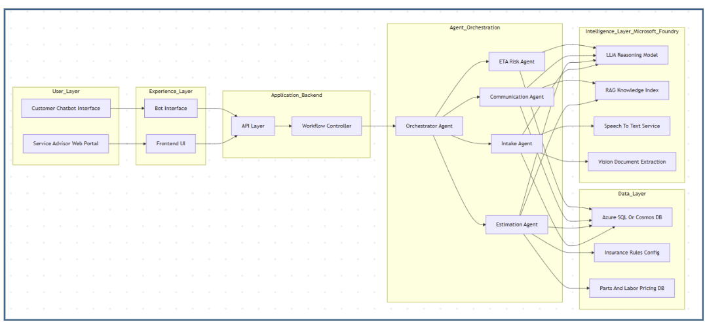
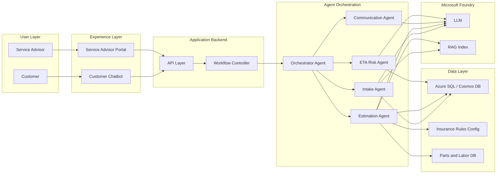

# Product Requirements Document: AI-Powered Service Intelligence

**Document version:** 1.0  
**Hackathon:** [Agents League](https://github.com/microsoft/agentsleague)  
**Track:** Reasoning Agents (Microsoft Foundry)  
**Submission deadline:** March 1, 2026 (11:59 PM PT)

---

## 1. Title & Meta

| Field | Value |
|-------|--------|
| **Project name** | AI-Powered Service Intelligence |
| **Hackathon** | Agents League (Feb 16–27, 2026) |
| **Track** | Reasoning Agents – Microsoft Foundry |
| **Submission deadline** | March 1, 2026 |

---

## 2. Vision & Positioning

Build an **AI-powered multi-agent system** that acts as a **Service Advisor Co-Pilot** for automobile service centres.

**Positioning statement:**  
*"We built an event-driven, multi-agent AI architecture that manages the entire vehicle service lifecycle—from intake to delivery—reducing manual effort and increasing operational efficiency."*

The system will:

- Reduce intake time  
- Automate estimation  
- Improve customer communication  
- Predict delays  
- Increase operational efficiency  

This is **not** a full ERP replacement. It is an **intelligent layer on top** of service workflows.

---

## 3. Problem & MVP Scope

### Core Problem We Are Solving

Service departments face:

- Manual intake and data entry  
- Time-consuming cost estimation  
- Inconsistent insurance handling  
- Delays due to poor coordination  
- Reactive customer communication  
- No structured intelligence from OBD data  

Our MVP addresses:

- Slow intake  
- Manual estimation  
- Poor customer updates  
- Lack of delivery prediction  

### What We Will Build (MVP)

| Component | Description |
|-----------|-------------|
| **Intake Agent** | Extracts complaint, mileage, service type, risk indicators; interprets OBD reports. |
| **Estimation Agent** | Maps fault codes to parts, applies pricing, warranty, and insurance logic; generates quotes. |
| **Communication Agent** | Handles customer notifications and chatbot responses. |
| **Basic ETA/Risk Agent** | Predicts delays and delivery times. |
| **Internal Web Portal** | For Service Advisors (intake, estimates, workflow). |
| **Customer Chatbot** | For approvals, questions, and notifications. |

### What We Will Simulate

- Insurance rules (config-driven logic)  
- Parts pricing database  
- OBD input (file upload)  
- Labor rate tables  

### What We Will NOT Build

- Full ERP  
- Real insurance APIs  
- Real OBD hardware integration  
- Telephony integration  

---

## 4. Primary & Secondary Users

| Role | Type | Description |
|------|------|-------------|
| **Service Advisor (Front Desk Executive)** | Primary (hero) | Talks to customers, creates job cards, generates estimates, coordinates repairs, communicates approvals. AI acts as their assistant. |
| **Workshop Manager** | Secondary | Uses tracking dashboard for oversight. |
| **Customer** | Secondary | Interacts via chatbot for approvals, questions, and notifications. |

---

## 5. Simpler Approach (Hackathon)

To keep the 2-week build achievable, we adopt these **explicit simplifications**:

| Area | Simplification |
|------|-----------------|
| **Orchestration** | One **Orchestrator Agent** in Foundry delegates to four specialized agents using Foundry **Connected Agents** (natural-language routing). No custom router. Depth limit: 2 (orchestrator → specialists only). |
| **Intelligence** | **One LLM deployment** (e.g. GPT-4o) for all agents; **one RAG Knowledge Index** (Azure AI Search) for service/OBD/parts knowledge. Speech-to-Text and Vision/Document for intake are optional and can be minimal or mocked in MVP. |
| **Data** | **No real external systems.** All data from **synthetic datasets** and **mocked configs** (insurance rules, parts/labor DB) in Azure SQL or Cosmos DB. |
| **Integrations** | No real insurance APIs, OBD hardware, or telephony. OBD = uploaded file; insurance = config-driven logic; notifications = in-app or chatbot only. |
| **Front-end** | Internal Web Portal and Customer Chatbot as **minimal UIs** calling the same backend/API. No full ERP; no SSO required for MVP. |
| **ETA/Risk** | **Basic** implementation (e.g. rule-based or simple model) for “predict delays” demo; no full forecasting stack. |

---

## 6. High-Level System Architecture

The system follows a layered architecture:

1. **User Layer** – Customer Chatbot Interface; Service Advisor Web Portal  
2. **Experience Layer** – Bot Interface; Frontend UI (both connect to API Layer)  
3. **Application Backend** – API Layer; Workflow Controller (sends commands to Orchestrator Agent)  
4. **Agent Orchestration** – Orchestrator Agent (routes to specialized agents); Intake, Estimation, Communication, ETA Risk agents  
5. **Intelligence Layer (Microsoft Foundry)** – LLM Reasoning Model; RAG Knowledge Index; Speech-to-Text Service; Vision Document Extraction  
6. **Data Layer** – Azure SQL or Cosmos DB; Insurance Rules Config; Parts and Labor Pricing DB  

High-level system architecture (place your diagram at `assets/architecture.png` to embed):

### Simplified Flow (Hackathon)

---

## 7. Microsoft Foundry Usage

Mapping of architecture components to Microsoft Foundry (Azure AI Foundry Agent Service):

| Architecture Component | Foundry Implementation |
|------------------------|------------------------|
| **Orchestrator Agent** | One Foundry Agent with **Connected Agent** tools pointing to the four specialist agents. Uses natural-language routing (no custom router). |
| **Intake Agent** | Foundry Agent with instructions + tools (e.g. OpenAPI or Azure Function for DB/config). Optional: Speech-to-Text, Vision/Document tools or stubs. |
| **Estimation Agent** | Foundry Agent with instructions + tools to read parts DB, labor rates, insurance config. |
| **Communication Agent** | Foundry Agent with instructions + tools to send notifications / format chatbot responses. |
| **ETA Risk Agent** | Foundry Agent with instructions + tools for basic delay prediction (rule-based or simple model). |
| **LLM Reasoning** | Single Foundry model deployment (e.g. GPT-4o) shared by all agents. |
| **RAG Knowledge Index** | Azure AI Search index attached to agents via Foundry knowledge/tools. |
| **Speech-to-Text / Vision Document** | Foundry-compatible tools (Azure AI Speech, Document Intelligence) or stubbed for MVP. |
| **Data Layer** | Azure SQL or Cosmos DB; agents access via **tools** (Azure Function or OpenAPI), not direct DB connection from Foundry. |

---

## 8. Synthetic Data Strategy

All data used in the MVP is **non-production, synthetic data** for demo and development only.

| Data Type | Description | Format / Volume |
|-----------|-------------|------------------|
| **Job cards / intake records** | Synthetic complaints, mileage, service types, risk flags. | 50–100 samples for RAG and testing. |
| **OBD-style reports** | Synthetic fault codes and short text for “upload OBD” flow. | PDF or text files for Vision/Document extraction. |
| **Parts and labor** | Part IDs, descriptions, prices; labor codes and rates. | Static CSV/JSON or table in Azure SQL/Cosmos (Parts and Labor Pricing DB). |
| **Insurance rules** | Rules for “covered vs customer-pay” and simple logic for Estimation Agent. | JSON/YAML config (Insurance Rules Config). |
| **RAG content** | Articles/snippets on fault codes, repair types, warranty/insurance wording. | Curated or generated content in Azure AI Search index. |

---

## 9. End-to-End Workflow

| Phase | Trigger | Flow | Agents | Simulated Data |
|-------|---------|------|--------|----------------|
| **Phase 1: Vehicle Intake** | Service Advisor clicks “New Intake” | Advisor speaks → Speech-to-Text → Intake Agent extracts complaint, mileage, service type, risk indicators. Advisor uploads OBD report → AI interprets fault codes. Structured job card auto-generated; advisor reviews and saves. | Intake Agent | OBD files, synthetic job templates |
| **Phase 2: Smart Estimation** | Advisor clicks “Generate Estimate” | Estimation Agent maps fault codes to parts, fetches parts pricing, adds labour, applies warranty and mocked insurance. System calculates total, customer payable, insurance payable; quote PDF generated. Advisor clicks “Send for Approval”. | Estimation Agent | Parts and Labor DB, Insurance Rules Config |
| **Phase 3: Customer Approval** | Quote sent | Customer receives chatbot notification; can view estimate, approve/reject, ask questions. AI explains e.g. “Why is brake pad replacement needed?” from OBD reasoning. If approved → Job status → In Progress. | Communication Agent, Intake/Estimation (for explanations) | RAG knowledge |
| **Phase 4: During Service** | Additional issue found | Advisor updates system; Estimation Agent recalculates; Communication Agent sends revised approval; ETA Agent recalculates delivery; customer notified. | Estimation, Communication, ETA Risk Agents | Parts DB, Insurance Config |
| **Phase 5: Completion** | Job marked complete | Customer notified; invoice summary sent; pickup/delivery option; payment confirmation; Job status → Closed. | Communication Agent | — |

**Outcome (Phase 1):** Job created in 4–5 minutes vs 15–20 manual.

---

## 10. Demo Strategy & Success Criteria

### Demo Flow (Live Scenario)

1. Customer conversation (intake)  
2. OBD upload  
3. AI generates job card  
4. AI generates estimate  
5. Customer approves via chatbot  
6. Delay prediction shown  
7. Final notification sent  
8. End with ROI / positioning statement  

### Success Criteria (Measurable)

| Criterion | Target |
|-----------|--------|
| Intake time | Job created in **&lt; 5 minutes** (vs 15–20 manual). |
| Estimation | **One-click** estimate generation from job card + OBD. |
| Customer approval | Approval and basic Q&amp;A (e.g. “Why brake pads?”) via chatbot. |

---

## 11. Out of Scope & Assumptions

### Out of Scope

- Full ERP  
- Real insurance APIs  
- Real OBD hardware integration  
- Telephony integration  
- Production-grade security/SSO (MVP uses minimal auth as needed)  

### Assumptions

- A Microsoft Foundry project and model deployment (e.g. GPT-4o) are available.  
- Synthetic data and configs (insurance rules, parts/labor DB) are prepared for demo.  
- Evaluators can run the app via README setup (local or cloud) and view demo materials.  

---

## 12. Risks & Dependencies

| Risk / Dependency | Mitigation |
|-------------------|------------|
| Foundry quotas / throttling | Use single model and minimal tool calls; document limits in README. |
| Synthetic data volume for RAG | Start with 50–100 job samples and focused RAG content; expand if time allows. |
| Connected Agents depth limit (2) | Keep orchestrator → four specialists only; no sub-agents under specialists. |
| Submission deadline (March 1, 2026) | Prioritize Phases 1–3 and demo path; Phase 4–5 can be simplified. |

---

## Appendix A: Agents League Alignment

### Track

- **Reasoning Agents** – Build with **Microsoft Foundry** (Azure AI Foundry Agent Service).  
- [Starter kit](https://github.com/microsoft/agentsleague/tree/main/starter-kits/2-reasoning-agents) and [Agents League README](https://github.com/microsoft/agentsleague).

### Judging Rubric (Reference)

| Criterion | Weight |
|-----------|--------|
| Accuracy & Relevance | 20% |
| Reasoning & Multi-step Thinking | 20% |
| Creativity & Originality | 15% |
| User Experience & Presentation | 15% |
| Reliability & Safety | 20% |
| Community vote | 10% |

### Submission Checklist

- [ ] Project meets Reasoning Agents track requirements (multi-agent, Foundry).  
- [ ] Repository is public and includes a **comprehensive README.md** with setup instructions.  
- [ ] No hardcoded API keys or secrets.  
- [ ] Demo materials included (video or screenshots).  
- [ ] [Disclaimer](https://github.com/microsoft/agentsleague/blob/main/DISCLAIMER.md) and [Code of Conduct](https://github.com/microsoft/agentsleague/blob/main/CODE_OF_CONDUCT.md) read and agreed; no confidential/proprietary/sensitive information submitted.  

Submit via [Agents League project submission template](https://github.com/microsoft/agentsleague/issues/new?template=project.yml).
