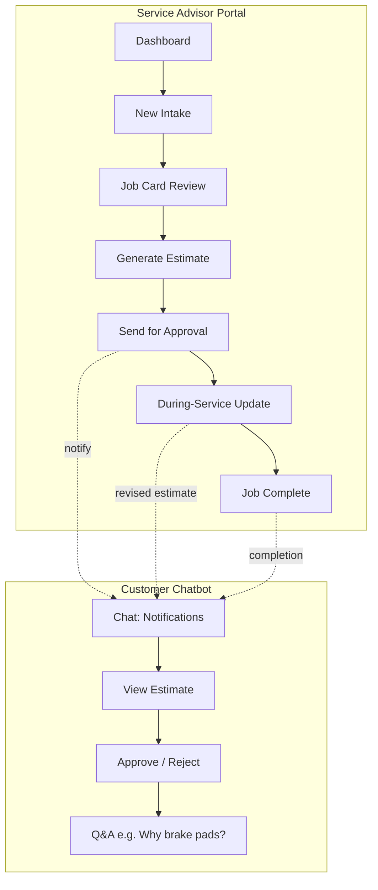

# Wireframes – AI-Powered Service Intelligence

This document describes wireframes for the **Internal Web Portal** (Service Advisor / Workshop Manager) and the **Customer Chatbot**, based on the [PRD](PRD.md), [Tech Stack](TECH_STACK.md), and [Synthetic Data and Data Model](SYNTHETIC_DATA_AND_DATA_MODEL.md). Use it to build screens in **Figma**, **Sketch**, **Balsamiq**, or the included **HTML wireframe** (`wireframes/index.html`).

---

## 1. Users and Entry Points

| User | Entry | Main Screens |
|------|--------|--------------|
| **Service Advisor** | Web Portal login | Dashboard, New Intake, Job Card, Generate Estimate, Send for Approval, During-Service Update |
| **Workshop Manager** | Web Portal (same app) | Dashboard / Tracking view, Job list with status |
| **Customer** | Chatbot (embedded or standalone) | Chat UI: notifications, view estimate, approve/reject, Q&A |

---

## 2. High-Level Screen Flow

---

## 3. Internal Web Portal – Screens

### 3.1 Portal Shell (Global)

- **Header:** Logo, app name "Service Intelligence", user (Advisor/Manager), optional logout.
- **Primary nav (vertical or top):**
  - Dashboard
  - New Intake
  - Jobs (list)
  - (Optional) Settings
- **Content area:** Right/below nav; each screen below is shown here.

---

### 3.2 Dashboard

- **Purpose:** Landing page; quick overview and actions.
- **Wireframe elements:**
  - **Stats row:** Cards or KPIs – e.g. "Open jobs", "Pending approval", "Completed today".
  - **Quick action:** Prominent "New Intake" button.
  - **Recent / open jobs table:** Columns – Job ID, Customer, Vehicle, Status, Last updated; row click → Job detail.
  - **Optional:** Simple list or cards for "Pending approval" and "In progress" for Workshop Manager view.

---

### 3.3 New Intake

- **Purpose:** Start a new job; capture complaint (and optionally OBD); AI generates draft job card.
- **Wireframe elements:**
  - **Complaint input:** Large text area – "Customer complaint / notes" (or placeholder for Speech-to-Text).
  - **Optional:** "Record" or "Upload OBD" button.
  - **Upload OBD:** File drop zone or file picker – "Upload OBD report (PDF or TXT)".
  - **Action:** "Generate job card with AI" button.
  - **Result:** After AI runs – show summary or redirect to **Job Card** (pre-filled). Optional loading/processing state.

---

### 3.4 Job Card (Review / Edit)

- **Purpose:** Review and edit AI-generated intake; save before estimation.
- **Wireframe elements:**
  - **Form (read/edit):**
    - Customer name, Vehicle (make, model, year), VIN (optional), Mileage.
    - Complaint (text), Service type (dropdown: e.g. maintenance | repair | inspection | diagnostic).
    - Risk indicators (tags or list), OBD fault codes (list from upload).
    - Optional: OBD document link/reference.
  - **Actions:** "Save", "Generate Estimate" (primary).
  - **Status:** Draft / Pending approval / In progress / Completed / Closed (display or dropdown).

---

### 3.5 Generate Estimate / Quote

- **Purpose:** One-click estimate from job card + OBD; show quote and send for approval.
- **Wireframe elements:**
  - **Trigger:** "Generate Estimate" on Job Card (or from Job detail).
  - **Quote view:**
    - Line items table: Part/labor description, quantity, unit price, total, "Covered by insurance" (Y/N).
    - Subtotal, Customer payable, Insurance payable, **Total**.
  - **Actions:** "Regenerate", "Send for Approval" (sends notification to customer chatbot).
  - **Optional:** "Download PDF" placeholder.

---

### 3.6 During-Service Update

- **Purpose:** Additional issue found; recalc estimate; notify customer; ETA update.
- **Wireframe elements:**
  - Same **Job Card** and **Quote** context.
  - **Update:** Add line items or notes; "Recalculate estimate" button.
  - **Revised quote** (same layout as 3.5); "Send revised estimate to customer".
  - **ETA / Risk:** Display predicted delivery or delay (e.g. "Estimated completion: …" or "Risk: delay possible").

---

### 3.7 Job Complete / Closed

- **Purpose:** Mark job complete; trigger completion notification to customer.
- **Wireframe elements:**
  - **Status:** Set to "Completed" or "Closed".
  - **Action:** "Mark complete and notify customer" (invoice summary, pickup/delivery in PRD).
  - Optional summary: total amount, payment status.

---

### 3.8 Jobs List (Optional Dedicated Screen)

- **Purpose:** List all jobs; filter by status; open Job Card or Estimate.
- **Wireframe elements:**
  - **Filters:** Status (draft, pending_approval, in_progress, completed, closed); optional date range.
  - **Table:** Job ID, Customer, Vehicle, Status, Created, Actions (View / Edit).
  - **Click row** → Job Card or detail view.

---

## 4. Customer Chatbot – Screens / States

### 4.1 Chat UI (Single Interface)

- **Purpose:** Notifications, view estimate, approve/reject, Q&A.
- **Wireframe elements:**
  - **Header:** "Service Center" or app name; optional minimal branding.
  - **Message list:** Bubbles – system messages (e.g. "Your estimate is ready", "Job completed"), estimate summary card (amount, link to view), and user/AI messages for Q&A.
  - **Estimate card (in chat):** Short summary – Total amount, Customer payable, "View full estimate" link/button; "Approve" and "Reject" buttons.
  - **Input:** Text field + Send for free-form questions (e.g. "Why is brake pad replacement needed?").
  - **Typing indicator** when AI is responding.

---

### 4.2 View Full Estimate (Optional Expand or Modal)

- **Purpose:** Show full quote inside chat or in a modal.
- **Wireframe elements:**
  - Same line-item structure as portal (3.5): parts, labor, totals, insurance/customer split.
  - "Approve" / "Reject" at bottom.

---

## 5. Flows Summary (For Figma)

| Flow | Screens (in order) |
|------|--------------------|
| **Intake → Estimate → Send** | Dashboard → New Intake → Job Card → Generate Estimate → Send for Approval |
| **Customer approval** | Chat: notification → View estimate → Approve/Reject → (optional) Q&A |
| **During service** | Job Card / Quote → During-Service Update → Revised quote → Send to customer; ETA shown |
| **Completion** | Job Complete → Notify customer; Chat: completion message, invoice summary |

---

## 6. Figma / Design Notes

- **Fidelity:** MVP = low to mid; grayscale or simple palette is fine.
- **Components to create once:** Header, Nav, Stat card, Data table, Form field, Primary/Secondary button, Chat bubble, Estimate card.
- **Responsive:** Portal can be desktop-first; chatbot may be embedded (iframe) or mobile-friendly.
- **Copy:** Use placeholders from this doc (e.g. "Customer complaint / notes", "Upload OBD report (PDF or TXT)").

---

## 7. HTML Wireframe

An **interactive HTML wireframe** is provided in **`docs/wireframes/index.html`**. Open that file in a browser to view all main screens as low-fidelity mockups with navigation between them. Use it as a reference or to hand off to Figma (recreate screens from the HTML layout).

---

## 8. References

- [PRD – End-to-End Workflow](PRD.md#9-end-to-end-workflow)
- [PRD – Primary & Secondary Users](PRD.md#4-primary--secondary-users)
- [Tech Stack – Frontend](TECH_STACK.md#1-stack-overview)
